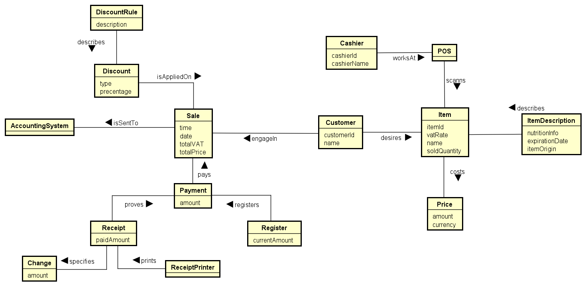

# RetailStore

## Description

This is a **console-based program** developed as the final project for the **IV1350 (Object-Oriented Design)** course. The project applies best practices in designing and implementing an object-oriented program for a retail store. The program demonstrates concepts such as **low coupling**, **high cohesion**, **encapsulation**, **fault tolerance**, **unit testing**, and the **layer pattern**.

In the final iteration, **design patterns** such as **Observer**, **Singleton**, and **Composition** have been utilized.

> **Note:** The current version uses one hard-coded sample to demonstrate example output. The program provides a solid foundation to build upon and extend its functionalities. For example, user interactivity could be added through terminal commands.

The **domain model** for this project is illustrated below:



## To see the rest of the design please check out ./src/main/resources/diagrams

## Setup

1. **Install Maven** on your machine.

   - Instructions for installing Maven on different operating systems can be found [here](https://maven.apache.org/install.html).
   - **Windows users:** Ensure the Maven `bin` folder is added to your **PATH** environment variable.

2. **Run the program**:

```bash
mvnd exec:java

Run the tests:
    mvnd test

Other useful Maven commands:
    mvnd clean
    mvnd package
```
